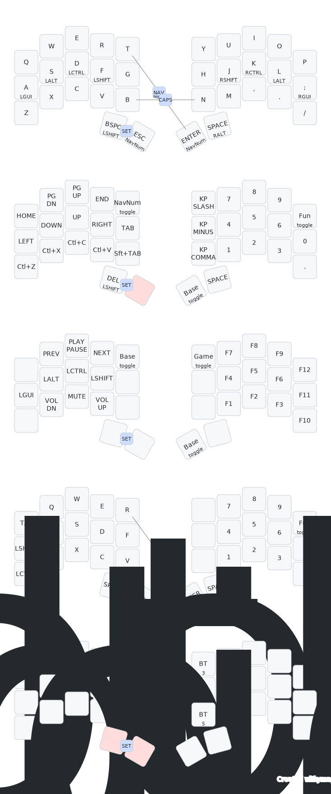

A firmware for the [Urchin Keyboard](https://github.com/duckyb/urchin) and the [Ergo-L layout](https://ergol.org/).

## Getting started

**Are you trying to make your own ZMK firmware?**
[Here are the steps you need to take.](./GETTING_STARTED.md)

**Do you want to download my keymap?**

> [!IMPORTANT]
> This firmware is meant to be used with the Ergo-L layout. Symbols and accents will be missing with other layouts.

[Download the firmware zip from the latest action run.](https://github.com/venator/zmk-urchin/actions/workflows/build.yml?query=is%3Asuccess+branch%3Amain) Check [the ZMK docs](https://zmk.dev/docs/user-setup#installing-the-firmware) for instructions on how to flash it.

## Keymap Cheat Sheet

<div align="center">

  

</div>

Diagram generated using [keymap-drawer](https://github.com/caksoylar/keymap-drawer):
```sh
keymap parse -c 10 -z config/urchin.keymap > urchin_keymap.yaml
keymap draw urchin_keymap.yaml > assets/urchin_keymap.svg
```

## References

This layout is inspired by:
- https://ergol.org/claviers/compacts/#kbd_3x5
- https://github.com/OneDeadKey/arsenik
- https://github.com/duckyb/urchin-zmk-firmware
- https://github.com/ulounge/zmk-urchin
- https://github.com/manna-harbour/miryoku_zmk
- https://github.com/hbmarchive/ferris-sweep
